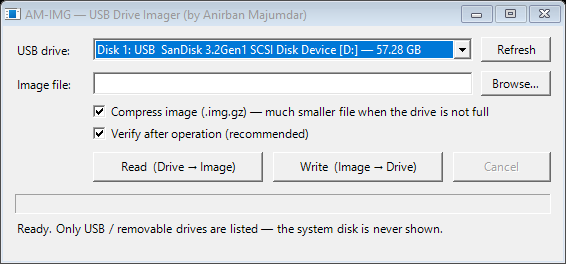
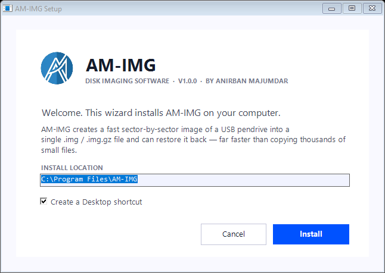

<p align="center">
  
</p>

<h1 align="center">AM-IMG — USB Drive Imager</h1>

<p align="center">
  Fast sector-by-sector imaging of USB pendrives on Windows.<br/>
  <b>Drive → .img / .img.gz → Drive</b>, with SHA-256 verification.<br/>
  <i>Developed by Anirban Majumdar</i>
</p>

---

## ⚠ Disclaimer — read before using

> **This tool was made for the developer's own personal use. It is not intended for public distribution.**
>
> AM-IMG performs **raw, sector-level writes to physical disks**. Used incorrectly — or in the presence of software bugs, hardware faults, or power failure — it can **permanently and irrecoverably erase data**. By downloading or using this software you accept that:
>
> - **The developer (Anirban Majumdar) is NOT responsible for any data loss, drive damage, or any other harm** arising from the use or misuse of this tool, under any circumstances.
> - The software is provided **"AS IS", without warranty of any kind** (see [LICENSE](LICENSE)).
> - You are solely responsible for verifying your backups and for every drive you choose to write to.
>
> If you do not agree, do not use this software.

## Download

**[⬇ Download AM-IMG-Setup.exe (latest release)](../../releases/latest/download/AM-IMG-Setup.exe)** — installer (recommended)

**[⬇ Download AM-IMG.exe (portable)](../../releases/latest/download/AM-IMG.exe)** — single-file portable version, no installation needed

Requires Windows 8.1/10/11 (64-bit) with .NET Framework 4.5+ (preinstalled on Windows 8.1 and later). Administrator rights are required at run time for raw disk access.

## Why

Copying a project-filled pendrive file-by-file (or zipping it, or making an ISO) is slow because of thousands of small files. AM-IMG reads the drive **sector by sector in one sequential pass** — the fastest way a USB drive can be read — into a single image file, and writes it back the same way.

## Features

- **Read** — image an entire USB drive into a single `.img` file
- **Write** — restore an image back to a drive (with a type-safe confirmation dialog)
- **Compression** — optional on-the-fly gzip (`.img.gz`); empty space compresses to almost nothing
- **Verify** — SHA-256 comparison after every read/write (on by default)
- **Safety first**
  - Only USB / removable drives are ever listed — the Windows system disk is detected via the Storage API (`IsBoot`/`IsSystem`) and **never shown**
  - Volumes are locked and dismounted before writing (no Explorer corruption)
  - Size guard: an image larger than the target drive is rejected
  - Live progress with speed, ETA and cancel
- **Zero dependencies** — a single small exe; the installer is self-contained too

## Screenshots

| Application | Installer |
|---|---|
|  |  |

## Build from source

No Visual Studio needed — builds with the C# compiler that ships inside Windows:

```powershell
powershell -ExecutionPolicy Bypass -File build.ps1
```

The pipeline compiles the engine, runs **21 automated tests** (byte-exact round trips, gzip, sector padding, cancellation, oversize rejection, safe-drive enumeration), builds `AM-IMG.exe`, embeds it into `AM-IMG-Setup.exe`, then runs a full install→verify→uninstall round-trip test. Output lands in `dist/`.

## How it works

- Opens `\\.\PHYSICALDRIVEn` raw device handles (`CreateFile`)
- `IOCTL_DISK_GET_LENGTH_INFO` / `GET_DRIVE_GEOMETRY_EX` for exact size and sector alignment
- `FSCTL_LOCK_VOLUME` + `FSCTL_DISMOUNT_VOLUME` on every volume of the target before writing
- 4 MiB aligned chunks; the final block is zero-padded to the physical sector size
- SHA-256 computed inline during the copy, re-read for verification

## License

MIT — see [LICENSE](LICENSE).
